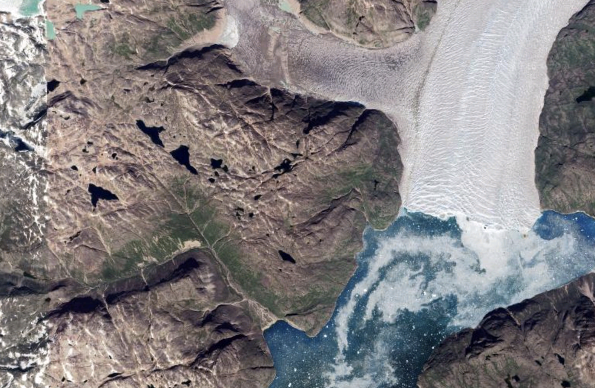

## About Me {.smaller}

:::: {.columns}

::: {.column width="70%"}
**Samuel Hsu (he/him/his)**

- From Portland, OR
- BS in Statistics: Data Science, UW Seattle, 2026
- MS in Statistics and Data Science, UW-Madison, 2028
- I enjoy playing with data, writing fun programs, and using statistics for meaningful applications (like improving education!)
:::

::: {.column width="30%"}

:::

::::

## Background {.smaller}

- Researchers at UW Seattle placed seismometers near a glacier in Southern Greenland
- When this glacier's ice melts and the glacier discharges water, it shakes the ground
- Goal: measure water discharged from glacier using ground tremor data



## The Data{.smaller}
- About 40 GB of time-series tremor data spanning about 2 years from 3 seismometers measuring 3D tremor data
- My analysis focuses on under a year of data, only the vertical (Z) axis, and an average of all three seismometers' data
- Below is a plot of seismometer data from a few days in August 2023

```{python}
import numpy as np
import scipy
import pandas as pd
import seaborn as sns
import matplotlib.pyplot as plt
import matplotlib.dates as mdates
import matplotlib.colors as mcolors
from matplotlib.lines import Line2D
import matplotlib
import datetime
import obspy
from obspy import UTCDateTime
from obspy.clients.filesystem.sds import Client
from multiprocessing import Pool
import statsmodels.api as sm
import statsmodels.formula.api as smf

# Read data
client = Client('../QJT_data/')

t_start = UTCDateTime('2023-08-15')
t_end = UTCDateTime('2023-08-30')
# only read 1 station and 1 channel for now
st_read = client.get_waveforms('XH', 'QJT03', '', 'HHZ', t_start, t_end)
st_read.merge()
initial_plot = st_read.plot()
```

## Determining a frequency range{.smaller}
- Glacial discharge tends to cause the ground to tremor at certain frequencies. Which frequencies?
- Solution: compare frequency patterns between summer (lot of melting) and winter (little melting)
    - Frequency ranges with biggest differences between summer and winter = frequencies indicating water discharge

```{python}
data = np.load('../psd.npz')
freqsArr = data['freqsArr']
PxxArr = data['PxxArr']

melt = np.vstack((PxxArr[1:100], PxxArr[-67:]))
weather = pd.read_csv("../meteo_bay_2022-24.csv")
weather["Year"] = weather["Time"].apply(lambda x: int(x[:10].split("-")[0]))
weather["Month"] = weather["Time"].apply(lambda x: int(x[:10].split("-")[1]))
weather["Day"] = weather["Time"].apply(lambda x: int(x[:10].split("-")[2]))
weather = weather[((weather["Year"] == 2023) & (weather["Month"] > 8)) | 
                  ((weather["Year"] == 2024) & (weather["Month"] < 7)) |
                  ((weather["Year"] == 2024) & (weather["Month"] == 7) & (weather["Day"] < 11))]
temps = weather.groupby(["Year", "Month", "Day"])["Temp [C]"].mean().to_numpy()
temps = np.hstack((temps[1:100], temps[-67:]))
warm = melt[temps >= np.median(temps)]
cool = melt[temps < np.median(temps)]
rows_warm = 10*np.log10(warm).T
rows_cool = 10*np.log10(cool).T

precision = 500
amplitudes = np.linspace(-20, 50, precision)
d_amplitude = amplitudes[1]-amplitudes[0]
histograms_warm = np.ones(precision)
histograms_cool = np.ones(precision)

for row in rows_warm:
    histograms_warm = np.vstack((histograms_warm, scipy.ndimage.histogram(row, -20, 50, precision)))
histograms_warm = histograms_warm / d_amplitude / len(rows_warm)

for row in rows_cool:
    histograms_cool = np.vstack((histograms_cool, scipy.ndimage.histogram(row, -20, 50, precision)))
histograms_cool = histograms_cool / d_amplitude / len(rows_cool)

plt.figure(figsize=(2*6.4,3))
im1 = plt.pcolormesh(np.linspace(0, 100, 6002), amplitudes, histograms_warm.T, vmin = 0, vmax = 0.005, cmap = "Reds") 
im2 = plt.pcolormesh(np.linspace(0, 100, 6002), amplitudes, histograms_cool.T, vmin = 0, vmax = 0.005, cmap = "Blues", alpha = 0.575)
plt.xscale('log')
plt.xlim(1, 100)
plt.title("Power spectral densities: winter vs. summer")
plt.xlabel("Frequency (Hz)")
plt.ylabel("Power (dB)")

custom_lines = [Line2D([0], [0], color=matplotlib.colormaps['Reds'](200), lw=4),
                Line2D([0], [0], color=matplotlib.colormaps['Blues'](200), lw=4)]
plt.legend(custom_lines, ['Summer', 'Winter'], loc = 'upper right')
```

## Measuring relative glacial melt{.smaller}
```{python}
times = np.load("results_all_z_new/0.npz", allow_pickle = True)["times"]
GHTs = np.load("results_all_z_new/0.npz", allow_pickle = True)["GHT"]
for i in range(1, 354):
    times = np.hstack((times, np.load("results_all_z_new/" + str(i) + ".npz", allow_pickle = True)["times"]))
    GHTs = np.dstack((GHTs, np.load("results_all_z_new/" + str(i) + ".npz", allow_pickle = True)["GHT"]))
    # print(str(i), end = '\r')

times = times[0]
np.shape(GHTs)
np.shape(times)
# GHTs
freqbounds = [(1, 4), (4, 7), (7, 10)]
stations = ['QJT01', 'QJT02', 'QJT03']

# Calculate mean GHT between stations
df_list = []

# Put GHT data into DataFrames
for idx1, freqbound in enumerate(freqbounds):
    for idx2, station in enumerate(stations):
      t = times.copy()
      GHT = GHTs[idx1, idx2, :].copy()
    #   print(np.shape(GHT))
    #   print(np.shape(t))
      df = pd.DataFrame(data=GHT, index=t, columns = [(freqbound, station)])
      df_alt = df.iloc[:-2] 
      df_list.append(df)

# Merge the three DataFrames into a single one
df_ght = pd.concat(df_list, axis='columns')

# Normalization
df_ght = df_ght.divide(df_ght.median(skipna=True))

# Rolling averaging for each station
df_ght = df_ght.rolling('6h', center=True).median()

df_ght.iloc[:, [0, 3, 6]] = df_ght.iloc[:, [0, 3, 6]] / df_ght.iloc[:, [0, 3, 6]].sum().sum()

df_ght.iloc[:, [1, 4, 7]] = df_ght.iloc[:, [1, 4, 7]] / df_ght.iloc[:, [1, 4, 7]].sum().sum()

df_ght.iloc[:, [2, 5, 8]] = df_ght.iloc[:, [2, 5, 8]] / df_ght.iloc[:, [2, 5, 8]].sum().sum()

# Mean between stations
df_ght['mean'] = df_ght.mean(axis='columns')

# Setting GHT relative to minimum power
df_ght = df_ght / np.nanmin(df_ght['mean'])

# Standard Deviation
df_ght['std'] = df_ght[:-1].std(axis='columns')

df_gps = pd.read_csv('GPS_box_moraine_splinesmooth_10min.csv', index_col=0)
df_gps['time'] = pd.to_datetime(df_gps['date']).dt.tz_localize(None)
df_gps.drop(['date'], axis='columns', inplace=True)
df_gps.set_index('time', inplace=True)

get_day = np.vectorize(lambda x: eval(x.strftime('%d + (int(\'%H\')/24) + (int(\'%M\')/1440) + (%S.%f/86400)')))


x = get_day(df_gps.index.to_pydatetime()).tolist()
y = df_gps['height_spline'].to_list()

pairs = sorted(list(zip(x,y)), key = lambda pair: pair[0])
x = [pair[0] for pair in pairs]
y = [- 5000000 * pair[1] / 3 for pair in pairs]

time_int = 300 / 60 / 60 / 24 # 300 seconds

xs_finals = []
# 12th, 16:21:55
start = 12 + 16/24 + 25/(24*60) 
curr = start
while curr < 16:
    xs_finals.append(curr)
    curr += time_int

volume_time_curve = scipy.interpolate.CubicSpline(x, y)
ys_finals = volume_time_curve.derivative()(xs_finals)

pairs = np.array(list(zip(xs_finals, ys_finals)))
xs_finals  = pairs[:,0]

xs_finals = [datetime.datetime(year = 2024, 
                        month = 7, 
                        day = int(x // 1), 
                        hour = int((x % 1 * 24) // 1),
                        minute = round(((x % 1 * 24) % 1 * 60)) % 60,
                        second = 0) for x in xs_finals]

ys_finals = pairs[:,1]
ys_finals /= 86400 # scales the discharge to m^3s^(-1)

discharge = dict(zip(xs_finals, ys_finals))

trimmed_df_ght = df_ght[(df_ght.index < datetime.datetime(2024, 7, 16)) & (df_ght.index > datetime.datetime(2024, 7, 12, 16, 20))]
trimmed_df_ght["discharge"] = trimmed_df_ght.index.to_series().apply(lambda x: discharge[pd.to_datetime(x).to_pydatetime()])
# ref_power = trimmed_df_ght.iloc[-77,:]["mean"]
trimmed_df_ght
sos = scipy.signal.butter(4, 1/(86400), 'lp', fs = 1/600, output = 'sos')
filtered_tremor = scipy.signal.sosfiltfilt(sos, trimmed_df_ght["mean"])

filtered_discharge = scipy.signal.sosfiltfilt(sos, trimmed_df_ght["discharge"])

more_trimmed_df_ght = trimmed_df_ght[trimmed_df_ght["discharge"] > 0]

model_find_slope = scipy.stats.linregress(np.log(more_trimmed_df_ght["mean"]), np.log(more_trimmed_df_ght["discharge"]))
power = model_find_slope.slope

model_own_power = scipy.stats.linregress(np.power(trimmed_df_ght["mean"], power), trimmed_df_ght["discharge"])
moe_own_power = model_own_power.stderr * 1.96
ols_df = pd.concat([trimmed_df_ght["discharge"], np.power(trimmed_df_ght["mean"], power)], axis = 1)

results = smf.ols('discharge ~ mean - 1', ols_df).fit()
slope = results.params.iloc[0]
moe = results.bse.iloc[0] * 1.96
before = df_ght.loc[(df_ght.index <= '2023-10-29 00:00:00'), "mean"]
during = scipy.signal.medfilt(df_ght.loc[(df_ght.index > '2023-10-29 00:00:00') & (df_ght.index < '2024-01-01 00:00:00'), "mean"], 361)
after = df_ght.loc[(df_ght.index >= '2024-01-01 00:00:00'), "mean"]
smoothened = np.concatenate([before, during, after])

fig = plt.figure(figsize=(12,3.6))
plt.plot(df_ght.index, np.sqrt(df_ght['mean']))
plt.ylabel('Relative Subglacial Discharge')
plt.xlabel('Time')
plt.title("Relative subglacial discharge over time")
plt.xlim(np.datetime64('2024-05-01'), np.datetime64('2024-08-01'))
```

- We now know that glacial discharge tends to cause vibrations at roughly 1-10 Hz.
- If we plot the strength of the vibrations at 1-10 Hz over time, we can get a relative measure of glacial discharge.
- But can we get an absolute measure of it?


## Finding a relationship between tremor and melt{.smaller}
- We have some direct discharge measurements from a lake outburst event in July 2024
    - We can find the relationship between discharge and tremor (for just July).
    - We can then model the rest of the year's discharge from our tremor data.
- According to the literature, discharge and tremor follow this relationship: $Q = aP^b$ where $Q$ is discharge, $P$ is tremor, and $a$ and $b$ are parameters we're estimating
- Results (using linear regression to fit a power law): $Q \approx `{python} round(float(slope), 3)` P^{`{python} round(float(power), 3)`}$

## Measuring absolute melt
Final estimate of glacial discharge:
```{python}
fig = plt.figure(figsize=(2*6.4,4.8))
plt.plot(df_ght.index, slope * np.power(smoothened, power))
plt.plot(more_trimmed_df_ght.index, more_trimmed_df_ght["discharge"])
plt.ylabel(r'Absolute Subglacial Discharge ($m^3/s$)')
plt.xlabel('Time')
plt.xlim(np.datetime64('2024-05-01'), np.datetime64('2024-08-01'))
plt.title("Subglacial discharge over time")
plt.legend(["Estimated", "Measured"])
```

## Takeaways{.smaller}
- We have a measurement of the glacial discharge.
- Not a perfect estimate: can the frequency range be more accurate? Does the same relationship hold throughout the year?
- Getting a wider interval estimate and accounting for error: estimates in parameters have error, and more carefully looking at different seismometers and different frequency ranges can give us a wider range of estimates
- Important in monitoring effects of climate change: getting good measurements of glacial melt and correlating it with temperature could be informative.